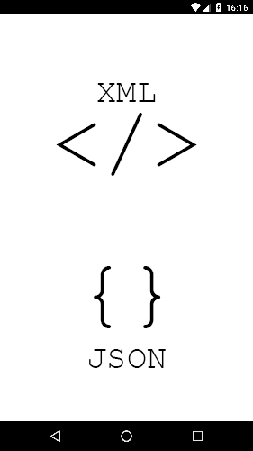

## Related post: [Transform XML to JSON in Ionic 2+ (with Angular 4.3+)](https://www.ionicrun.com/transform-xml-to-json-in-ionic-2-with-angular-4-3/)

<p align="center">
  
</p>

## Step by step

```bash
$ git clone https://github.com/ionicrun/transform-xml-to-json-ionic-2.git
$ cd transform-xml-to-json-ionic-2
```

```bash
$ npm i
# or
$ ionic cordova platform add android ios
```

## Done

You're all set! Go ahead and serve or run the Ionic 2+ (with Angular 4.3+) App and transform your XML into JSON!

```bash
$ ionic serve
# or
$ ionic cordova run ios
# or
$ ionic cordova run android
```